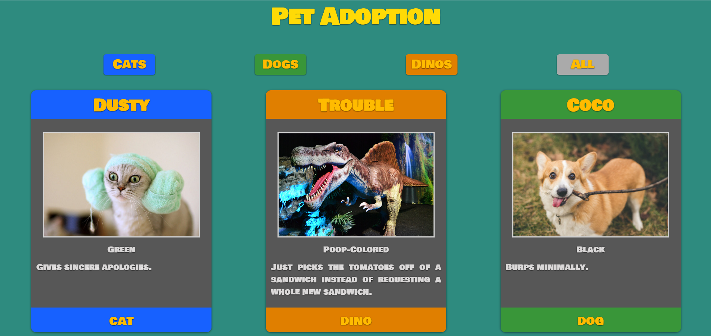

# pet-adoption

## Description 
This project is an exploration into how to display and filter cards on a page. I created a card from scratch to display a collection of pets (cats, dogs, and dinosaurs). I also gave our users the ability to filter the pets by cats, dogs, dinos, and all (display all cards). This page was created by passing an array of cards objects through a card builder function that then passed strings of updated html into a function that prints to DOM.

## Screenshots

## How to Run
1. Clone down this repo
2. Make sure you have http-server installed via npm. If not get it
[HERE](https://www.npmjs.com/package/http-server)
3. On your command line run `hs -p 8080`
4. In your browser go to `https://localhost:8080`
